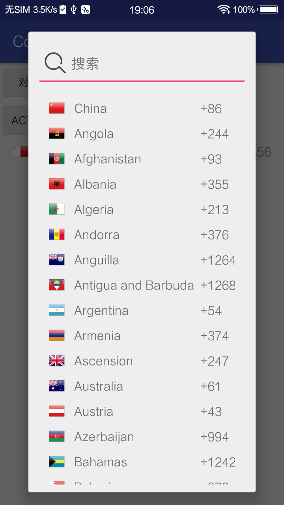
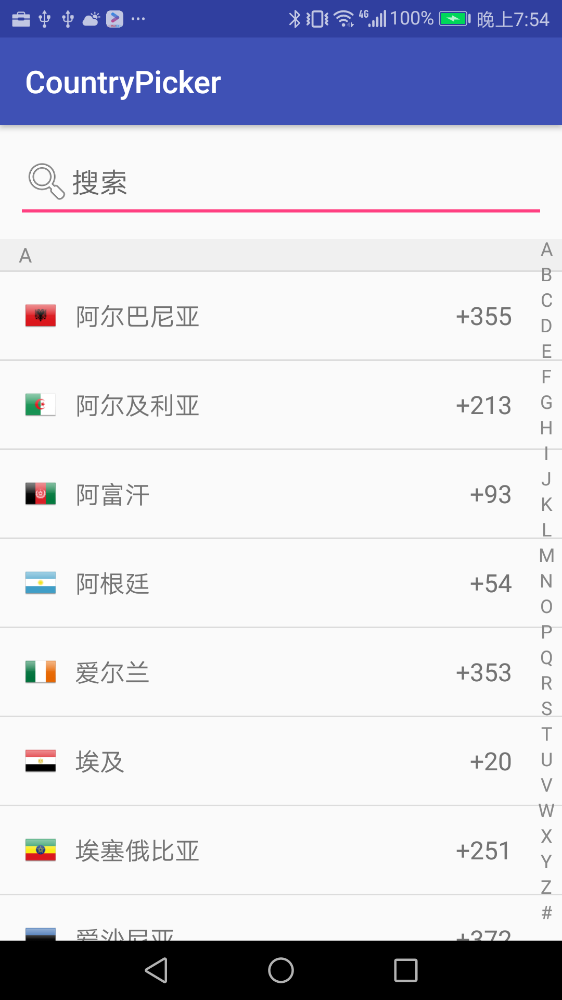

# country-picker-android [](https://jitpack.io/#sahooz/country-picker-android)

**[中文说明](./README.md)**  

Languages supported：  
1. Simplify Chinese
2. Tradictional Chinese
3. English  
4. Many other languages

Add dependency：

```
allprojects {
    repositories {
        ...
        maven { url 'https://jitpack.io' }
    }
}

...

implementation 'com.github.sahooz:country-picker-android:3.0.0'
```

The two optional pickers： 

1. DialogFragment version    
Sample： 
```java
CountryPickerFragment.newInstance(new PickCountryCallback() {
    @Override
    public void onPick(Country country) {
        if(country.flag != 0) ivFlag.setImageResource(country.flag);
        tvName.setText(country.name);
        tvCode.setText("+" + country.code);
    }
}).show(getSupportFragmentManager(), "country");
```
What it looks like：  
  

2. Activity version  
Sample  
```java
startActivityForResult(new Intent(getApplicationContext(), PickActivity.class), 111);

@Override
protected void onActivityResult(int requestCode, int resultCode, Intent data) {
    super.onActivityResult(requestCode, resultCode, data);
    if(requestCode == 111 && resultCode == Activity.RESULT_OK) {
        Country country = Country.fromJson(data.getStringExtra("country"));
        if(country.flag != 0) ivFlag.setImageResource(country.flag);
        tvName.setText(country.name);
        tvCode.setText("+" + country.code);
    }
}
```
What it looks like：  
     


When the device language is changed, do this：
```java 
// Take a little while
Country.load(this);
```  

Destroy it after usage： 
```java 
Country.destroy();
```

The code is very simple, but supporting multiple languages is very time consuming. Hope it help.

## Update Log  

### 3.0  

1. Update datasource, fix old data errors  
2. Sopport more langaues